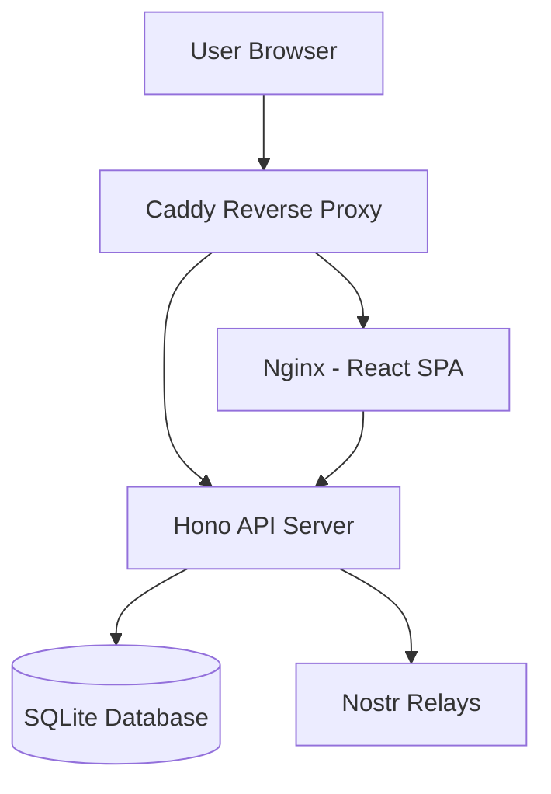
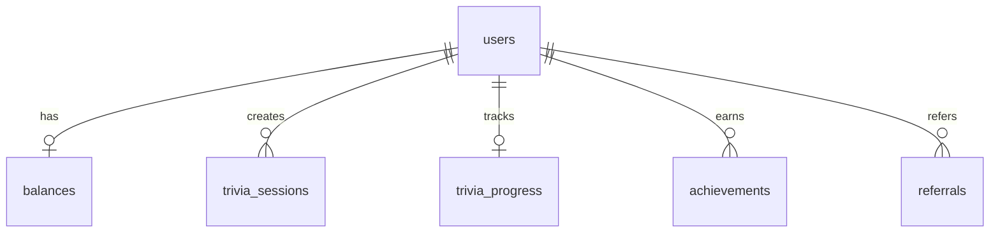
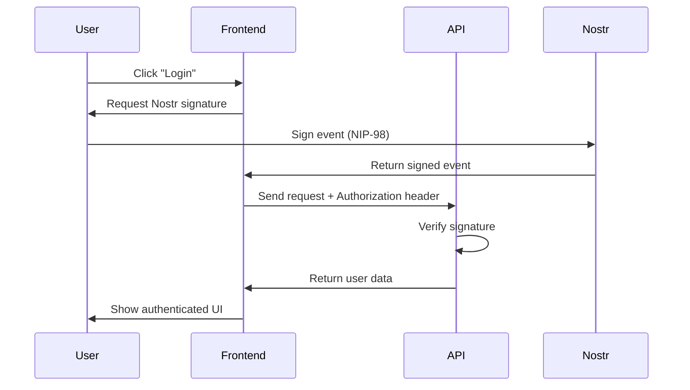
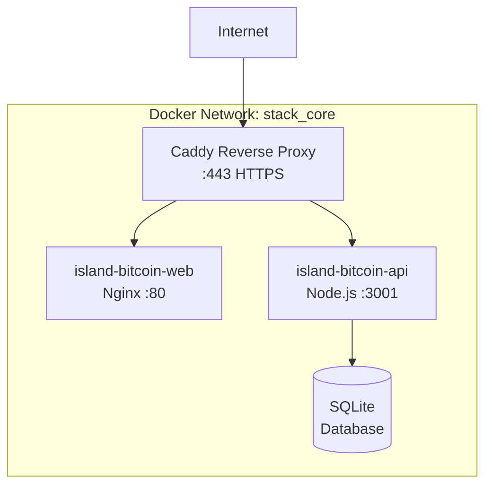

# Architecture

This document describes the technical architecture of the Island Bitcoin Community platform.

## Table of Contents

- [System Overview](#system-overview)
- [Monorepo Structure](#monorepo-structure)
- [Frontend Architecture](#frontend-architecture)
- [Backend Architecture](#backend-architecture)
- [Database Schema](#database-schema)
- [Authentication Flow](#authentication-flow)
- [Deployment Architecture](#deployment-architecture)

## System Overview

Island Bitcoin Community is a full-stack web application built as a monorepo using Turborepo. The system consists of:

- **Frontend**: React SPA served via Nginx
- **Backend**: Hono API server with SQLite database
- **Authentication**: Nostr-based (NIP-07, NIP-46, NIP-98)
- **Rewards**: Lightning Network integration (planned)



## Monorepo Structure

```
island-bitcoin-community/
├── apps/
│   ├── web/                    # Frontend React application
│   │   ├── src/
│   │   │   ├── components/     # React components
│   │   │   ├── hooks/          # Custom React hooks
│   │   │   ├── lib/            # Utility functions
│   │   │   ├── pages/          # Page components
│   │   │   └── main.tsx        # Entry point
│   │   ├── public/             # Static assets
│   │   └── package.json
│   │
│   └── api/                    # Backend API server
│       ├── src/
│       │   ├── db/             # Database schema & migrations
│       │   ├── middleware/     # Hono middleware
│       │   ├── routes/         # API route handlers
│       │   └── index.ts        # Server entry point
│       └── package.json
│
├── packages/
│   ├── nostr/                  # Shared Nostr utilities
│   │   ├── src/
│   │   │   ├── auth.ts         # NIP-98 authentication
│   │   │   └── utils.ts        # Nostr helpers
│   │   └── package.json
│   │
│   └── shared/                 # Shared TypeScript types
│       ├── src/
│       │   └── types.ts        # Common type definitions
│       └── package.json
│
├── drizzle/                    # Database migrations
├── docker-compose.yml          # Docker orchestration
├── Dockerfile                  # Multi-stage build
└── turbo.json                  # Turborepo configuration
```

## Frontend Architecture

### Technology Stack

- **Framework**: React 18 with TypeScript
- **Build Tool**: Vite
- **Styling**: TailwindCSS + Radix UI
- **State Management**: React Query (TanStack Query)
- **Routing**: React Router v6
- **Nostr**: @nostrify/nostrify, nostr-tools

### Key Components

#### Authentication
- `LoginButton.tsx` - Handles Nostr login (NIP-07, NIP-46, nsec)
- `useCurrentUser.ts` - User state management
- `useLoginActions.ts` - Login/logout actions

#### Bitcoin Trivia
- `BitcoinTrivia.tsx` - Main trivia game component
- `useTriviaQuestions.ts` - API integration for trivia
- `useTriviaProgress.ts` - Progress tracking

#### Events & Gallery
- `EventCard.tsx` - Event display component
- `CommunityGallery.tsx` - Photo gallery
- `useEvents.ts` - Event data fetching

### State Management

The application uses React Query for server state management:

```typescript
// Example: Fetching trivia progress
export function useTriviaProgress() {
  const { user } = useCurrentUser();
  
  return useQuery({
    queryKey: ["trivia-progress", user?.pubkey],
    queryFn: () => fetchProgress(user),
    enabled: !!user?.pubkey,
    staleTime: 30 * 1000,
  });
}
```

### Feature Flags

Environment variables control feature visibility:

```bash
VITE_FEATURE_TRIVIA_GAME=false      # Bitcoin trivia game
VITE_FEATURE_LEADERBOARD=false      # Leaderboards
VITE_FEATURE_COMMUNITY_FEED=false   # Community feed
```

## Backend Architecture

### Technology Stack

- **Framework**: Hono (lightweight web framework)
- **Runtime**: Node.js
- **Database**: SQLite with Drizzle ORM
- **Authentication**: NIP-98 (Nostr HTTP Auth)

### API Routes

```
/api/
├── /health                     # Health check
├── /auth/
│   └── /verify                 # Verify Nostr signature
├── /trivia/
│   ├── /session/start          # Start trivia session
│   ├── /session/answer         # Submit answer
│   ├── /session/current        # Get active session
│   └── /progress               # Get user progress
├── /events                     # List events
├── /gallery                    # Community photos
└── /leaderboard                # Top users
```

### Middleware

#### Authentication Middleware

```typescript
// Required authentication
export const requireAuth = async (c, next) => {
  const authHeader = c.req.header('Authorization');
  const pubkey = await verifyNIP98(authHeader);
  if (!pubkey) throw new HTTPException(401);
  c.set('pubkey', pubkey);
  await next();
};

// Optional authentication (guest + authenticated)
export const optionalAuth = async (c, next) => {
  const authHeader = c.req.header('Authorization');
  const pubkey = await verifyNIP98(authHeader);
  c.set('pubkey', pubkey || null);
  c.set('isGuest', !pubkey);
  await next();
};
```

#### Rate Limiting

- **Guest users**: IP-based rate limiting (X-Forwarded-For)
- **Authenticated users**: Pubkey-based rate limiting
- **Limits**: Configurable per endpoint

## Database Schema

### Core Tables

#### users
```sql
CREATE TABLE users (
  pubkey TEXT PRIMARY KEY,
  created_at INTEGER NOT NULL DEFAULT (unixepoch()),
  lightning_address TEXT
);
```

#### balances
```sql
CREATE TABLE balances (
  user_id TEXT PRIMARY KEY REFERENCES users(pubkey) ON DELETE CASCADE,
  balance INTEGER NOT NULL DEFAULT 0,
  pending INTEGER NOT NULL DEFAULT 0,
  total_earned INTEGER NOT NULL DEFAULT 0,
  total_withdrawn INTEGER NOT NULL DEFAULT 0,
  last_activity TEXT NOT NULL DEFAULT (datetime('now')),
  last_withdrawal TEXT
);
```

#### trivia_sessions
```sql
CREATE TABLE trivia_sessions (
  id TEXT PRIMARY KEY,
  user_id TEXT NOT NULL REFERENCES users(pubkey) ON DELETE CASCADE,
  level INTEGER NOT NULL,
  question_ids TEXT NOT NULL,  -- JSON array
  answers TEXT NOT NULL DEFAULT '[]',  -- JSON array
  started_at TEXT NOT NULL DEFAULT (datetime('now')),
  expires_at TEXT NOT NULL,
  completed_at TEXT,
  status TEXT NOT NULL DEFAULT 'active'  -- 'active', 'completed', 'expired'
);
```

#### trivia_progress
```sql
CREATE TABLE trivia_progress (
  user_id TEXT PRIMARY KEY REFERENCES users(pubkey) ON DELETE CASCADE,
  level INTEGER NOT NULL DEFAULT 1,
  questions_answered TEXT NOT NULL DEFAULT '[]',  -- JSON array of question IDs
  correct INTEGER NOT NULL DEFAULT 0,
  streak INTEGER NOT NULL DEFAULT 0,
  best_streak INTEGER NOT NULL DEFAULT 0,
  sats_earned INTEGER NOT NULL DEFAULT 0,
  level_completed INTEGER NOT NULL DEFAULT 0
);
```

### Relationships



## Authentication Flow

### NIP-98 HTTP Authentication



### Supported Login Methods

1. **NIP-07 (Browser Extension)**
   - nos2x, Alby, Flamingo
   - Uses `window.nostr.signEvent()`

2. **NIP-46 (Remote Signer)**
   - nsec.app, Amber
   - Uses `NostrSigner` interface

3. **Direct nsec**
   - Paste private key
   - Local signing only

## Deployment Architecture

### Production Infrastructure



### Container Details

| Container | Image | Port | Purpose |
|-----------|-------|------|---------|
| `caddy` | caddy:latest | 443→443 | Reverse proxy, SSL termination |
| `island-bitcoin-web` | island-community-web | 8082→80 | Nginx serving React SPA |
| `island-bitcoin-api` | island-community-api | 3002→3001 | Hono API server |

### Domain Routing

```
community.islandbitcoin.com
├── /api/*          → island-bitcoin-api:3001
├── /health         → island-bitcoin-api:3001
└── /*              → island-bitcoin-web:80
```

### Data Persistence

- **Database**: SQLite file mounted as Docker volume
- **Location**: `/opt/stack/island-community/data/db.sqlite`
- **Backups**: Automated daily backups (recommended)

## Security Considerations

### Authentication
- All API requests require NIP-98 signature verification
- No passwords stored - Nostr keypair authentication only
- Guest mode available for non-sensitive features

### Rate Limiting
- IP-based for guest users
- Pubkey-based for authenticated users
- Prevents abuse and spam

### Data Privacy
- User data tied to Nostr pubkey (pseudonymous)
- No email or personal information required
- Lightning addresses optional

### CORS & Headers
- Strict CORS policy
- Security headers (X-Frame-Options, CSP, etc.)
- HTTPS enforced in production

## Performance Optimizations

### Frontend
- Code splitting with React.lazy()
- Image optimization
- TailwindCSS purging
- Vite build optimizations

### Backend
- SQLite with proper indexing
- Connection pooling
- Query optimization with Drizzle ORM
- Response caching where appropriate

### Infrastructure
- Caddy compression (gzip, zstd)
- Nginx static file caching
- Docker multi-stage builds

## Monitoring & Logging

### Health Checks
- `/health` endpoint for container health
- Docker health checks configured
- Uptime monitoring (recommended)

### Logging
- Application logs via Docker logs
- Error tracking (to be implemented)
- Analytics (privacy-respecting)

## Future Enhancements

- [ ] Lightning Network integration for payouts
- [ ] Real-time features with WebSockets
- [ ] Mobile app (React Native)
- [ ] Advanced analytics dashboard
- [ ] Multi-language support
- [ ] Progressive Web App (PWA)

---

For deployment instructions, see [DEPLOYMENT.md](DEPLOYMENT.md).  
For contribution guidelines, see [CONTRIBUTING.md](CONTRIBUTING.md).
